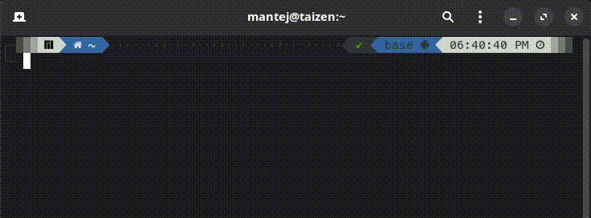

# Calc

**Calc** is a **blazing-fast**, **GPU-accelerated**, **insanely precise**, **latex-supporting**, **scientific calculator** that runs in the **terminal**. Made in **C++**, calc uses *multithreading* and *asynchronous* techniques to provide answer even before you hit the enter button!

> Checkout how **Calc-API** was used to **train AI models** to hit fascinating benchmarks in math problems here



Whether you're a Linux enthusiast, a scientist, or an AI researcher, Calc delivers **unparalleled speed, precision, and versatility** straight to your terminal.  

### **Key Features that Set Calc Apart:**  
- **Interactive Mode:** Save sessions, reuse variables, and pick up where you left off—all within an intuitive terminal experience.  
- **Unmatched Speed & Precision:** Solve calculations with **up to one googol decimal places of accuracy**, perfect for high-stakes scenarios where every digit counts.  
- **GPU Acceleration:** Tackle heavy computations like matrix operations, integrations, and differentiations effortlessly using GPU power.  
- **Advanced Algebra:** Solve systems of linear equations, handle matrix operations, and perform algebraic calculations with ease.  

- **File-Based Problem Solving:** Process multiple problems from a text file and output solutions to another file or directly to the terminal.  
- **Latex Support:** Effortlessly handle complex mathematical expressions, making Calc a favorite among students and researchers.  


A command-line calculator built in C++ that handles basic arithmetic operations through terminal arguments. Inspired by a deep dive into C++'s command-line argument handling (`argc` and `argv`), this project demonstrates how to create practical CLI tools while exploring core language concepts. 🚀

## Installation ⚙️

### Linux 🐧 or MacOS 🍎

```bash
curl -sSL https://raw.githubusercontent.com/mantejjosan/calc/refs/heads/main/install.sh | bash -s /usr/local/bin
```

### Windows 🖥️ or Termux

1. **Install a C++ Compiler**:  
   Ensure you have a C++ compiler installed on your system, such as:
   - **MinGW**: [Download MinGW](https://sourceforge.net/projects/mingw/)
   - **Clang**: Install via [LLVM](https://llvm.org/)
   - **MSVC**: Use the Visual Studio C++ Build Tools ([Download Visual Studio](https://visualstudio.microsoft.com/))

   If you already have a compiler installed, proceed to the next step.

2. **Clone the Repository**:  
   Open a terminal (PowerShell, Command Prompt, or Git Bash) and run:
   ```bash
   git clone https://github.com/mantejjosan/calc.git
   cd calc
   ```

3. **Build the Project**:  
   Create a `build` directory and compile the project:
   ```bash
   mkdir build 
   cd build
   cmake ..
   make
   ```

4. **Run the Program**:  
   The `calc.exe` file will be created in the `build` directory. You can run it directly:
   ```bash
   .\calc.exe "(12-3(3*2))"
   ```

5. **Add to PATH (Optional)**:  
   To use `calc` from anywhere in your terminal:
   - Move the `calc.exe` to a folder already in your PATH (e.g., `C:\Windows\System32`).
   - Or, add the `build` directory to your PATH:
     - Search for "Environment Variables" in the Start Menu.
     - Under "System Variables," find `Path` and edit it.
     - Add the full path to the `build` directory.

## Contribute 🤝

1. Clone this Git repository:
    ```bash
    git clone git@github.com:mantejjosan/calc.git
    ```

    If you haven't set up SSH, check out this easy [step-by-step guide](https://mantejjosan.github.io/tutorials/CollaborateOnGithub/SetUpSshKey).

2. Explore and contribute! 🚀


<details>

<summary><h3>The Story Behind: An Exciting Discovery 📚</h3></summary>

During my exploration of C++ programming through Ray Lischner's *Exploring C++*, I encountered an intriguing statement that sparked my curiosity:

> "If someone disputes the fact that the `main` function could also be `void`, refer the skeptic to section 3.6.1 of the C++ standard." 🧐

As a Linux user, I was well-versed in utilizing commands such as `pwd`, `ls`, and `grep` in the terminal environment. However, this particular passage prompted me to investigate the underlying mechanisms of these command-line tools.

Through my research, I discovered an enlightening aspect of the `main` function in C++. While many programmers typically implement the basic `int main()` structure, there exists a more sophisticated variant:

```cpp
int main(int argc, char* argv[])
```

Although initially complex in appearance, this structure serves a fundamental purpose in handling command-line arguments. Consider the following compilation command:

```bash
g++ hello.cpp -o hello
```

Each component becomes a distinct argument: `g++` represents argument 0, `hello.cpp` serves as the input file, `-o` functions as a flag, and `hello` designates the output filename. The program manages these elements through `argc` (argument count) and `argv` (argument vector).

### Understanding argc and argv 🧩

The power of command-line arguments lies in how we can access and utilize them within our programs. When you run a program from the command line, `argc` tells you how many arguments were provided, including the program name itself. Meanwhile, `argv` holds these arguments as strings in an array.

Think of it this way: `argv[0]` always contains the name of your program, while `argv[1]` onwards contain the actual arguments you typed after the program name. This simple yet powerful system allows programs to understand and process user input directly from the command line. 💡

This understanding ultimately led to the development of a command-line calculator application. What began as an academic observation transformed into a practical project that enhanced my comprehension of fundamental command-line tool architecture.

- `argv[0]` contains the program name
- `argv[1]` through `argv[argc-1]` contain the actual arguments

Consider this example: if you make a program that would read input files, process them, and produce output files, and execute it as such:

```cpp
./compressor
```

In order for this to work, you would either store the address of input files and output files inside the program in a variable or array or prompt the user to enter the address during runtime.

However, there is another way, a concise one:

```cpp
./compressor input.txt output.rar
```

Also, if your program works by using multiple files, say all `.txt` files in one directory, this would save a lot of time:

```bash
./compressor *.txt output.rar
```

The `*` is called a **wildcard** in Linux. 🐾

</details>


